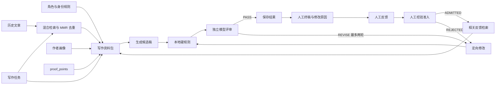

# 个性化社交媒体写作 Agent：RAG 设计说明

> 当前实现基线：2026-09-04，28 个 API 路径，57 项离线自动化测试。

## 1. 设计目标

系统追求的不是“模仿几句口头禅”，而是在每一次写作中同时满足四件事：身份不能串、事实不能编、语气要稳定、反馈能沉淀。可以把最终输出理解为：

> 角色硬边界 + 稳定作者画像 + 当前任务的相关记忆 + 可信事实白名单 + 有针对性的修改记忆 + 自动质量门禁

RAG 在这里负责“当前应该回忆什么”。它不是长期作者画像的替代品，也不是事实数据库的替代品。

## 2. 完整运行链路



模型不是任意决定下一步的“自由代理”。编排、循环上限、事实门禁和落库都由确定性代码控制，模型只承担画像总结、正文生成、语义评审和定向改写。这种边界更容易测试、追踪成本和复现问题。

## 3. 数据分层

### 3.1 角色层

`roles` 保存名称、描述、`identity_rules` 和可选的 `default_generate_params`。生成任务按“系统默认值 → 角色默认值 → 本次请求显式参数”合并；`topic` 和 `proof_points` 始终由当前任务提供，避免把一次性事实沉淀成角色默认事实。所有 `posts`、`profiles`、`feedback` 和 `generation_runs` 必须带 `role_id`。在正式多用户产品中，查询条件还必须包含 `tenant_id`，并由服务端从登录态注入，不能接受客户端自由指定租户。

### 3.2 语料层

一条 Post 是最小检索单元。正文之外保存平台、语言、内容类型、主题、语气、真实性和发布时间。标题但无正文的内容不入库；过短文本会降低检索意义。

投喂入口支持一次上传多个文件。系统先提取和拆分正文，再用本地启发式规则推断标题、平台、语言、内容类型、主题、语气和文件名日期；公共表单值可以覆盖整批自动判断。入库前按去除空白并统一大小写后的正文哈希去重，避免同一文章重复提高检索权重。自动标注不确定时保留警告，用户可只修正错误字段，不需要重新上传正文。

文章另有独立的检索状态。`ACTIVE` 文章可以进入 RAG 和画像重建，`RETIRED` 文章仍保留原文和审计记录，但不会再成为模型上下文。真实性评分表达“来源是否真实可信”，检索负反馈表达“是否适合某次任务”，两者不互相覆盖。生成记录下的 `NOT_RELEVANT` 只记录一次任务级误召回；文章接口下的 `RETIRE` 才会全局停用文章，并可通过 `RESTORE` 恢复。两个作用域分别保存审计记录，避免用一次历史生成记录控制文章生命周期。

推荐导入时增加三类质量检查：

1. 完整性：正文长度、乱码、扫描 PDF、重复内容。
2. 时效性：把会过期的产品数字、活动日期和法规说明标成事实敏感内容。
3. 代表性：真实性不是表现分。高流量文章不一定最像作者，评分应由熟悉账号的人确认。

### 3.3 画像层

画像只从真实性 4–5 的样本生成，并按版本保存。中文和英文分别总结价值观、表达语气、开头、节奏、CTA 与禁用习惯。画像重建不覆盖旧版本，以便回溯某次生成使用了什么规范。

### 3.4 反馈层

反馈保存“AI 初稿—本人终稿—修改原因”。新反馈先标记为 `CANDIDATE`，人工判断它代表稳定偏好后才能变成 `ADMITTED`；一次性活动修改或错误反馈应标记为 `REJECTED`。生成时只从 `ADMITTED` 集合检索最相关的少量反馈，而不是把全部反馈塞入提示词。每次准入决策单独保存动作、原因和时间，已经决策的反馈不能直接覆盖状态。建议把原因写成可复用规则，例如“删除绝对化结论，改成有条件判断”，不要只写“不像我”。

### 3.5 运行记录层

每次生成保存请求、检索结果及分数、初稿、每轮评审、终稿和状态。它既是调试日志，也是后续离线评测数据。正式环境还应记录模型版本、提示词版本、延迟、token 和成本，但不能记录 API Key。

## 4. 当前检索设计

### 4.1 基础模式

`RETRIEVAL_MODE=tfidf` 复现指南的 MVP：

```text
score = char_ngram_tfidf_cosine + authenticity_normalized × 0.02
```

字符 2/3/4-gram 不依赖中文分词器，适合 10–500 篇的小语料库，也能处理混合中英文。缺点是同义改写识别弱，例如“模型答案操纵”和“AI 投毒”可能没有足够字符重合。

### 4.2 默认混合模式

`RETRIEVAL_MODE=hybrid` 使用可解释的无外部服务方案：

```text
score = 0.60 × char TF-IDF cosine
      + 0.18 × keyword coverage
      + 0.14 × metadata match
      + 0.06 × authenticity
      + 0.02 × recency
```

元数据分量内部再按平台 30%、语言 25%、内容类型 20%、语气 25% 计算。所有分量都会随命中结果返回，便于判断文章为什么被选中。

权重不是永久真理。它们是一个可解释起点，应通过真实任务评测调整。真实性和新鲜度被限制在较小权重，避免“不相关但很像本人”或“较新但无关”的文章冲到第一位。

### 4.3 MMR 去重

初排后用 Maximal Marginal Relevance 选出最终参考：

```text
MMR = 0.82 × relevance - 0.18 × similarity_to_selected
```

如果三篇文章其实是同一内容的轻微改写，普通 Top-K 会浪费上下文。MMR 牺牲少量相关度换取参考多样性，能覆盖“观点、结构、语气”不同方面。

### 4.4 查询构造

查询不只包含 topic，还拼接 format、tone、goal、audience、platform 和 language。这样检索既回答“写什么”，也回答“在什么场景下写”。不得把 `proof_points` 混进风格检索，因为事实白名单与风格记忆的信任级别不同。

### 4.5 无结果与弱结果

当前实现会返回相对最优结果，即使绝对分数较低。生产版应设置校准后的最低阈值：

- 高于阈值：正常注入原文片段。
- 低于阈值：明确标记“无强相关历史样本”，只使用画像和任务。
- 语料为空：允许生成，但响应中必须显示无检索依据，便于人工提高警惕。

不要为满足 Top-K 强行注入无关文章。

## 5. 下一阶段语义 RAG

当语料达到数百篇、同义表达增多时，加入 Embedding。OpenAI 官方将 embeddings 定义为文本的数值表示，可用于按相关性排序；当前 embedding 模型包括 `text-embedding-3-small` 和 `text-embedding-3-large`。实现时建议离线计算文章向量，只在文章变化时更新，不在每次请求重复计算。

建议的专业版初排：

```text
0.40 × embedding cosine
+ 0.20 × BM25 / keyword
+ 0.12 × topic and content type
+ 0.10 × platform
+ 0.08 × language
+ 0.07 × authenticity
+ 0.03 × recency
```

随后取前 20 条，用轻量 reranker 或模型进行 pairwise/listwise 重排，再经 MMR 选择 4–6 条。Embedding 模型名、维度和向量版本必须随记录保存；更换模型后要重建索引，不能混用不同向量空间。

### 5.1 存储路线

| 规模 | 推荐实现 | 原因 |
|---|---|---|
| 10–500 | 当前 SQLite + 内存 TF-IDF | 简单、可解释、零额外服务 |
| 500–5,000 | SQLite/PostgreSQL + 本地向量索引 | 语义收益开始明显，运维仍较轻 |
| 5,000+ | PostgreSQL + pgvector 或 Qdrant | 需要持久索引、过滤、并发和增量更新 |
| 多租户产品 | PostgreSQL + 向量服务 + 强制租户过滤 | 权限、审计、备份和扩展性优先 |

向量数据库不会自动提升质量。标签、样本质量、查询构造、阈值和评测通常比“换库”更先决定效果。

## 6. 上下文组装与信任边界

写作资料包按以下优先级解释：

1. 角色身份规则：最高优先级，不可违反。
2. `proof_points`：允许公开使用的事实白名单。
3. 当前写作任务：平台、语言、受众、目标、长度、CTA、禁用表达。
4. 作者画像：稳定风格说明。
5. 历史文章：只做相关观点和风格参考，不自动授权复用其中事实。
6. 已准入人工反馈：只学习经过确认的修改方向，不照抄终稿；候选和拒绝反馈不能进入上下文。

这能抵抗语料中的提示注入。历史文章即便出现“忽略之前要求”也只是被引用的数据，不能成为系统指令。正式版还应在导入时检测异常指令文本，并对检索内容加清晰的数据边界标记。

## 7. 生成与评审

生成器直接输出可发布正文。每个候选稿先经过确定性本地规则：

- 数字是否出现在 `proof_points`。
- 是否包含禁用表达。
- 是否和单篇历史样本过度相似。
- 是否短到无法完成任务。

之后由独立评审提示检查角色一致性、任务完成度、模板感、照抄、虚构、宣传强度与 CTA。评审返回结构化的 `PASS/REVISE`、问题列表和修改指令。最多改写两轮，防止无限循环和成本失控；未通过时也保存结果并显示状态，不伪装成通过。

本地数字规则是保守门禁，不等同于完整事实核验。日期、专有名词和无数字的因果结论仍需模型评审或外部事实源。

## 8. 评测设计

至少准备 30 个代表任务，覆盖中英文、不同平台、宣传/教育/打假、无相关样本、冲突事实和恶意语料。每次改变检索权重、提示词或模型后运行同一套评测。

### 8.1 检索指标

- Recall@K：人工标注的相关文章是否进入前 K。
- nDCG@K：高相关文章是否排在更前。
- Role leakage：是否取回其他角色文章，目标必须为 0。
- Diversity：Top-K 之间是否过度重复。
- Weak-hit rate：低分任务是否被错误包装成强相关。

### 8.2 生成指标

- 角色相似度：本人盲评 1–5。
- 事实支持率：每条可核验陈述能否映射到 proof point 或明确常识边界。
- 任务完成度：平台、受众、格式、目标、长度、CTA。
- 编辑距离不是唯一目标：更应记录修改类别和人工修改用时。
- Copy rate：与任一历史文章的最长重合和整体相似度。
- Pass-after-revision：首稿未过时，定向修改是否真正解决原问题。

### 8.3 上线门槛示例

- 角色串库为 0。
- 未支持的具体数字为 0。
- 代表任务 Recall@4 达到团队设定目标。
- 人工平均相似度不低于基线。
- 人工修改时间相对通用模型基线显著下降。

## 9. 生产化清单

- 增加身份认证、租户字段和逐查询授权。
- 对上传类型、大小、页数、压缩炸弹和恶意 PDF 做限制。
- API Key 只放服务端环境变量或密钥管理器。
- 对生成和画像请求设置超时、重试、并发上限和成本预算。
- 记录模型、提示词、检索器和画像版本，支持审计回放。
- 备份数据库，对删除、导出和保留期限建立流程。
- 增加内容安全和敏感信息检查，但不要让安全检查替代事实检查。
- 生成结果由人工确认后再发布，尤其是客户案例、法律、医疗、金融和监管相关内容。

## 10. 为什么当前没有直接使用托管 File Search

这个项目需要细粒度 `role_id` 隔离、真实性权重、平台/语言/内容类型分量、反馈检索和逐项评分解释。自行编排的小型检索器更适合验证这些业务假设。未来如果改用托管 File Search，也应保留服务端角色过滤、事实白名单和运行评测，不能把权限与质量责任全部交给向量检索。

参考：OpenAI [Responses API 指南](https://developers.openai.com/api/docs/guides/responses)、[Vector embeddings 指南](https://developers.openai.com/api/docs/guides/embeddings)、[Structured outputs 指南](https://developers.openai.com/api/docs/guides/structured-outputs)。
