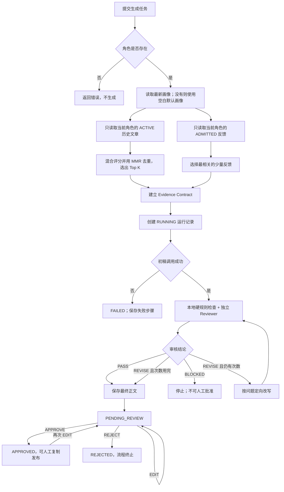

# 个性化社交媒体写作 Agent 简明使用手册

> 文档版本：2026-09-04，与当前 28 个 API 路径和 57 项自动化测试保持一致。

## 1. 这个系统能做什么

这个 Agent 根据指定角色的历史文章和人工确认过的修改经验，生成符合该角色表达习惯的社交媒体内容。

它不是简单地把历史文章复制给模型，而是依次完成：

```text
创建角色 → 导入历史文章 → 建立作者画像 → RAG 检索
→ 建立事实合同 → 生成初稿 → 独立审核 → 必要时定向改写
→ 人工审批 → 选择性沉淀反馈
```

一次完整使用最终会产生：

- 一篇或多篇候选正文；
- 每篇正文对应的 `run_id`；
- 自动审核结论和问题列表；
- RAG 命中的文章、分数和命中原因；ru
- 从检索到最终结果的完整运行轨迹；
- 人工编辑、批准或拒绝的审计记录；
- 经人工准入后可供未来生成使用的反馈经验。

当前系统不会自动发布到社交媒体。人工批准后，需要自己复制正文到发布平台。

---

## 2. 第一次启动

建议使用 Python 3.11 或更高版本。在项目目录打开 PowerShell：

```powershell
python -m venv .venv
.\.venv\Scripts\Activate.ps1
pip install -r requirements.txt
Copy-Item .env.example .env
python -m app.cli init
uvicorn app.main:app --reload
```

浏览器打开：

```text
http://127.0.0.1:8000/docs
```

后续所有操作都可以在 Swagger 页面完成：展开接口，点击 `Try it out`，填写参数，再点击 `Execute`。

### 2.1 建议先使用 Mock 模式

在 `.env` 中设置：

```dotenv
LLM_MODE=mock
```

Mock 模式不访问网络、不消耗 API 费用，适合熟悉流程和测试数据库。

需要真实生成时再改成：

```dotenv
LLM_MODE=live
LLM_PROVIDER=deepseek
DEEPSEEK_API_KEY=你的密钥
DEEPSEEK_MODEL=deepseek-v4-flash
```

或者使用 OpenAI：

```dotenv
LLM_MODE=live
LLM_PROVIDER=openai
OPENAI_API_KEY=你的密钥
OPENAI_MODEL=你的可用模型
```

修改 `.env` 后需要重新启动服务。真实密钥只能保存在 `.env`，不要写进代码、文档或提交到 Git。

---

## 3. 最短使用路径

### 第一步：创建角色

调用 `POST /roles`：

```json
{
  "name": "我的个人账号",
  "description": "面向 AI 产品经理，分享实际项目经验",
  "identity_rules": "不得虚构客户、收入、项目结果或个人经历；不作绝对化承诺",
  "default_generate_params": {
    "platform": "小红书",
    "language": "zh-CN",
    "format": "项目复盘",
    "audience": "刚开始学习 AI Agent 的产品经理",
    "tone": "真实、克制、具体",
    "length": "500-800字",
    "banned_phrases": ["颠覆行业", "绝对领先"]
  }
}
```

记录响应里的 `id`。后续的文章、画像、生成和反馈都必须使用这个 `role_id`。

项目也自带 `role_id=2` 的演示角色，可以直接用来测试。

`default_generate_params` 是这个角色长期重复使用的任务模板。已有角色可以通过 `PATCH /roles/{role_id}` 增加或修改它，不需要重新创建角色。

同一个人需要新建另一个平台账号时，可以调用 `POST /roles/{role_id}/clone`，只提供新名称和平台等覆盖项。它会复制身份规则和任务默认值，但不会复制历史文章、画像、反馈及生成记录。

### 第二步：投喂历史文章

少量文章可以调用 `POST /posts`：

```json
{
  "role_id": 2,
  "title": "我第一次做 RAG 的复盘",
  "text": "这里填写完整历史文章，至少 20 个字符……",
  "platform": "小红书",
  "language": "zh-CN",
  "content_type": "项目复盘",
  "topic": "RAG,AI Agent",
  "tone": "真实,克制",
  "authenticity": 5,
  "source_name": "本人历史文章"
}
```

推荐使用 `POST /posts/bulk-upload`：在 Swagger 的 `files` 中一次选择多个文件，只填写一次 `role_id` 和整批文章的真实性。平台、语言、类型、主题、语气都可以留空。

自动导入过程为：

```text
最多 30 个文件
→ 提取 PDF/TXT/Markdown 文本
→ 按分隔线或 Markdown 标题拆分
→ 自动推断标题、平台、语言、类型、主题、语气和文件名日期
→ 计算规范化正文指纹kai
→ 重复则跳过，不重复则入库
→ 返回成功、跳过、失败及警告清单
```

自动推断使用本地规则，不调用模型、没有额外费用。系统会识别常见的小红书、LinkedIn、微信公众号和微博标记；无法确定的平台会留空并返回警告，不会编造标签。

如果一批文章来自同一平台，可以只在表单里填写一次 `platform`，它会覆盖本批文件的自动判断。单文件不超过 10 MB，一批最多 50 MB。

导入后发现标注不正确，调用 `PATCH /posts/{post_id}` 只改错误字段：

```json
{
  "platform": "小红书",
  "content_type": "项目复盘",
  "topic": "RAG 实践",
  "tone": "真实,克制",
  "authenticity": 5
}
```

原有的 `POST /posts` 和单文件 `POST /posts/upload` 继续保留；单文件上传现在也复用批量上传的自动标注和去重逻辑。

如果多篇文章需要相同修正，调用 `PATCH /posts/bulk`：

```json
{
  "role_id": 2,
  "post_ids": [12, 13, 14, 15],
  "changes": {
    "platform": "小红书",
    "content_type": "项目复盘",
    "authenticity": 5
  }
}
```

系统会先确认所有文章都属于该角色，再在一个数据库事务中修改。任何 ID 不存在或属于其他角色时，整批不修改，避免只完成一半。

`authenticity` 建议这样填写：

| 分数 | 含义 | 是否用于画像 |
|---:|---|---|
| 5 | 确认是本人且很有代表性 | 是 |
| 4 | 是本人文章，风格基本稳定 | 是 |
| 3 | 可参考，但代表性一般 | 否 |
| 1–2 | 他人内容、过时内容或不确定来源 | 否 |

### 第三步：建立角色画像

调用：

```text
POST /profile/rebuild?role_id=2
```

系统只读取该角色下 `authenticity >= 4` 的文章，最多取 30 篇，生成中英文画像，包括：

- 稳定价值观；
- 语气；
- 常用开头；
- 行文节奏；
- CTA 习惯；
- 应避免的表达。

每次重建都会创建新版本，不会覆盖旧画像。如果没有合格文章，画像重建会失败并提示先导入真实性为 4–5 的文章。

### 第四步：提交写作任务

如果角色已经配置默认生成参数，最短请求只需要：

```json
{
  "role_id": 2,
  "topic": "第一次做 RAG 项目后，我改变了哪些判断",
  "proof_points": [
    "项目使用 FastAPI、SQLite 和本地混合检索"
  ]
}
```

系统按以下顺序合并参数：

```text
系统默认值 → 角色 default_generate_params → 本次请求显式参数
```

本次请求优先级最高。响应中的 `effective_request` 是最终实际生效的完整参数，可用于确认有没有继承错误。

调用 `POST /generate`：

```json
{
  "role_id": 2,
  "topic": "第一次做 RAG 项目后，我改变了哪些判断",
  "platform": "小红书",
  "language": "zh-CN",
  "format": "项目复盘",
  "goal": "分享真实经验并建立专业可信度",
  "audience": "刚开始学习 AI Agent 的产品经理",
  "tone": "真实、克制、具体",
  "length": "500-800字",
  "banned_phrases": ["颠覆行业", "绝对领先"],
  "proof_points": [
    "项目使用 FastAPI、SQLite 和本地混合检索",
    "当前自动改写最多执行 2 轮"
  ],
  "cta": "邀请读者分享自己的 RAG 实践问题",
  "candidates": 1
}
```

最重要的字段是：

- `topic`：具体写什么；
- `goal`：希望读者看完后理解或行动什么；
- `audience`：内容写给谁；
- `proof_points`：本次允许使用且希望写入的真实事实；
- `banned_phrases`：绝对不能出现的表达；
- `candidates`：生成 1–3 个候选版本。

不要把未经确认的数据放入 `proof_points`。历史文章默认只提供风格和判断背景，不会自动成为本次事实依据。

### 第五步：人工审核内容

生成成功后，响应中会返回 `run_id`，内容进入 `PENDING_REVIEW`。

查看待审核列表：

```text
GET /review-inbox?role_id=2&status=PENDING_REVIEW&limit=100&offset=0
```

列表项中的 `review_summary` 会直接显示：

- `auto_status`：最终自动审核状态；
- `review_count`：审核次数；
- `rewrite_count`：实际改写次数；
- `issues`：各轮审核累计发现的问题；
- `blocked_reason`：审核阻塞原因；
- `summary_text`：可以直接展示的中文摘要。

因此通常可以先在列表中快速判断，只有需要查看完整轨迹时再请求生成详情。

查看某次生成的完整详情：

```text
GET /generations/{run_id}
```

编辑正文：

```json
{
  "action": "EDIT",
  "edited_text": "这里填写人工修改后的完整正文……",
  "reason": "删除模板化开头，增加真实判断"
}
```

批准使用：

```json
{
  "action": "APPROVE",
  "reason": "事实、语气和表达已经确认"
}
```

拒绝内容：

```json
{
  "action": "REJECT",
  "reason": "选题方向不合适，不应继续使用"
}
```

以上三个请求都提交到：

```text
POST /generations/{run_id}/review-actions
```

### 第六步：把修改经验沉淀给未来任务

如果人工修改包含可复用的稳定偏好，调用 `POST /feedback`：

```json
{
  "role_id": 2,
  "task_summary": "RAG 项目复盘类小红书内容",
  "draft": "Agent 原始正文……",
  "final_text": "本人确认后的正文……",
  "reason": "少用概念堆叠；先讲实际问题，再解释技术判断",
  "similarity_rating": 5
}
```

新反馈的状态是 `CANDIDATE`，此时不会影响后续生成。

确认它代表长期偏好后，调用 `POST /feedback/{feedback_id}/admission`：

```json
{
  "action": "ADMIT",
  "reason": "适用于未来所有项目复盘内容"
}
```

如果修改只适用于一次活动，则拒绝沉淀：

```json
{
  "action": "REJECT",
  "reason": "这次修改来自临时活动要求，不代表长期风格"
}
```

候选反馈较多时，调用 `POST /feedback/admission/bulk`，一次提交同一角色下最多 100 个 `feedback_id`。任意一条不属于该角色或已经完成决策时，整批操作都会回滚。

### 第七步：纠正错误的 RAG 命中

从 `/generate` 响应的 `retrieved` 中取得文章 `post_id`，向 `POST /generations/{run_id}/retrieval-feedback` 提交：

| 动作 | 用途 | 对未来检索的影响 |
|---|---|---|
| `NOT_RELEVANT` | 文章只是不适合当前任务 | 记录原因，不改变真实性和全局状态；当前返回 `RECORDED_ONLY` |

系统会验证该文章确实出现在这次运行的检索结果中，防止记录与本次任务无关的负反馈。

如果文章已经过时、需要全局退出 RAG，则调用 `POST /posts/{post_id}/retrieval-status`：

- `RETIRE`：退出后续 RAG 和画像重建；
- `RESTORE`：恢复进入 RAG 和画像候选。

这类文章生命周期动作不依赖生成记录，并通过 `GET /posts/{post_id}/retrieval-actions` 保留审计历史。

---

## 4. 系统完整路径与判断机制



### 4.1 角色和画像路径怎么判断

1. 系统先根据 `role_id` 查询角色。
2. 角色不存在时立即停止，避免把其他角色的数据误用于本次任务。
3. 角色存在时读取最新画像版本。
4. 如果还没有构建画像，生成不会完全中断，而是使用空白默认画像继续；但个性化程度会明显下降。
5. 重建画像时，只接受当前角色中真实性评分 4–5 的文章。

因此，角色决定“数据属于谁”，画像决定“这个人通常怎么表达”。

### 4.2 RAG 如何决定取哪些历史文章

检索前先执行硬隔离：只读取当前 `role_id` 的文章，不允许跨角色召回。

查询文本由以下内容拼接：

```text
topic + format + tone + goal + audience + platform + language
```

每篇历史文章由以下内容拼接：

```text
content_type + topic + tone + platform + language + title + text
```

默认 `hybrid` 模式的总分为：

```text
总分 = 字符 n-gram TF-IDF 相似度 × 60%
     + 关键词重合度 × 18%
     + 元数据匹配度 × 14%
     + 真实性 × 6%
     + 时效性 × 2%
```

元数据匹配度内部再按以下比例计算：

```text
平台 30% + 语言 25% + 内容格式 20% + 语气 25%
```

这里的“语义相似度”实际是中文字符 2、3、4-gram 的 TF-IDF 余弦相似度，不是 embedding。它适合当前小规模中文语料，优点是本地、快速、可解释；缺点是面对完全不同措辞但意思相同的内容时，召回能力有限。

得到基础排名后，系统不会简单拿前 K 篇，而是使用 MMR 降低重复：

```text
MMR = 当前文章相关性 × 82% - 与已选文章的重复度 × 18%
```

第一篇选择基础分最高的文章；后续文章同时考虑相关性和多样性，避免几篇近似文章占满上下文。最终返回 `final_score`、五项分数和文字版 `reason`。

### 4.3 反馈 RAG 如何判断能不能使用

反馈在“相关性判断”之前先经过状态门禁：

```text
CANDIDATE：等待人工判断，不可检索
ADMITTED：允许进入反馈检索
REJECTED：永久排除
```

只有当前角色的 `ADMITTED` 反馈会被转换成检索候选，再按当前任务选出最多 2 条相关经验。传给生成器的内容包括 `feedback_id`、原稿、人工终稿和修改原因。

准入和相关性是两个不同问题：

- 准入判断“这条经验是否长期可信”；
- 相关性判断“这次任务是否需要回忆它”。

### 4.4 Evidence Contract 如何建立事实边界

RAG 完成后，程序使用本地规则建立 Evidence Contract，不调用模型。合同包含：

- 去重后的 `proof_points`，作为本次必写或允许使用的事实；
- 含数字的 proof point，作为允许出现的数字依据；
- `banned_phrases`；
- 角色的 `identity_rules`；
- 本次参考文章 ID；
- 平台、语言和内容格式；
- 无依据数字数必须为 0、禁用词数必须为 0、与单篇历史文章相似度不得超过 0.72。

角色画像和历史文章告诉模型“如何表达”，Evidence Contract 告诉模型“哪些事实和表达边界不能越过”。Draft、Reviewer 和 Revision 始终使用同一份合同。

### 4.5 初稿如何生成

Draft Agent 接收：

```text
角色信息 + 最新画像 + RAG 历史文章 + 已准入反馈
+ 当前任务 + Evidence Contract + 候选编号
```

模型被要求直接输出正文，并遵守三个原则：

1. 历史文章只学习观点组织、节奏和语气，不逐句仿写；
2. 不添加合同之外的数字、客户、案例、结果和亲历；
3. 反馈只用于避免重复错误。

每个候选稿独立创建一个 `run_id`。如果 Draft 调用异常，该运行直接标记为 `FAILED`，并保存错误发生在哪一步。

### 4.6 Reviewer 如何决定 PASS、REVISE 或 BLOCKED

审核分成两层。

第一层是本地确定性规则：

- 是否出现 `proof_points` 之外的数字；
- 是否出现禁用表达；
- 与某篇历史文章的整体相似度是否超过 0.72；
- 正文去除首尾空白后是否少于 40 个字符。

第二层是独立 Reviewer 模型：

- 角色是否一致；
- 是否完成任务；
- 是否有明显 AI 模板感；
- 是否照抄；
- 是否虚构事实或客户结果；
- 宣传强度是否过高；
- CTA 和禁用表达是否合适。

最终判断规则：

| 条件 | 结论 | 后续路径 |
|---|---|---|
| 本地和模型都没有问题 | `PASS` | 停止自动改写，进入人工审批 |
| 任意一层发现问题 | `REVISE` | 有剩余次数则定向改写并再次审核 |
| Reviewer 请求失败、返回空内容或非法结构 | `BLOCKED` | 立即停止，不得当成通过 |
| 达到最大改写次数后仍有问题 | `REVISE` | 保存当前版本，交给人工决定 |

本地问题优先级高于模型。即使模型说 `PASS`，只要本地规则发现问题，最终仍然是 `REVISE`。

默认最多改写 2 次，因此最多可能出现 3 次审核：

```text
review_1 → revise_1 → review_2 → revise_2 → review_3
```

### 4.7 人工审批路径怎么判断

自动审核状态和人工审批状态是两套不同状态：

- 自动状态回答“机器检查结果如何”；
- 人工状态回答“用户是否允许使用”。

状态规则如下：

| 当前状态 | 可执行动作 | 结果 |
|---|---|---|
| `PENDING_REVIEW` | `EDIT` | 保持 `PENDING_REVIEW` |
| `PENDING_REVIEW` | `APPROVE` | 变成 `APPROVED` |
| `PENDING_REVIEW` | `REJECT` | 变成 `REJECTED` |
| `APPROVED` | `EDIT` | 重新变成 `PENDING_REVIEW` |
| `REJECTED` | 无 | 不能通过编辑绕过拒绝 |
| `FAILED/BLOCKED` | 无 | 审批状态为 `NOT_APPLICABLE` |

每个动作都保存修改前文本、修改后文本、统一 diff、原因和时间。自动 `PASS` 从来不等于人工 `APPROVED`。

### 4.8 运行轨迹记录了什么

正常运行通常记录：

```text
retrieve → contract → draft → review_1
→ revise_1（如果需要）→ review_2 → final
```

每一步保存：

- 输入摘要；
- 输出；
- 模型供应商和模型名；
- Prompt 版本；
- 耗时；
- 完成或失败状态；
- 错误信息。

通过 `GET /generations/{run_id}` 可以看到运行结果、步骤、审核历史和当前人工正文。这样内容不好时，可以判断问题来自检索、事实合同、初稿、审核还是改写。

---

## 5. 最终产出怎么看

`POST /generate` 的主要响应结构为：

```json
{
  "mode": "mock 或 live",
  "provider": "mock、openai 或 deepseek",
  "model": "实际模型名",
  "profile_version": 1,
  "retrieved": [
    {
      "post_id": 1,
      "title": "命中的历史文章",
      "final_score": 0.42,
      "reason": "内容语义相关、关键词重合、高真实性样本"
    }
  ],
  "candidates": [
    {
      "run_id": 10,
      "draft": "模型最初生成的正文",
      "final_text": "自动审核和改写后的正文",
      "status": "PASS",
      "approval_status": "PENDING_REVIEW",
      "reviews": []
    }
  ]
}
```

重点字段：

- `retrieved`：系统为什么参考这些历史文章；
- `draft`：未经自动修订的第一版；
- `final_text`：自动流程最终产物，但还未获得人工批准；
- `status`：`PASS`、`REVISE`、`BLOCKED` 或 `FAILED`；
- `approval_status`：是否进入人工审批，以及人工是否已经批准；
- `run_id`：查看轨迹、编辑、批准、拒绝和评测时使用的唯一编号。

真正适合人工复制发布的内容应满足：

```text
current_text = 人工确认后的当前正文
approval_status = APPROVED
```

`final_text` 只是自动流程产出；如果人进行了编辑，应以生成详情中的 `current_text` 为准。

---

## 6. 常见问题

### 为什么生成内容不像本人？

优先检查：是否使用了正确的 `role_id`、是否至少导入数篇真实性 4–5 的本人文章、是否重建了画像、任务的语气和受众是否写清楚。

### 为什么历史文章有数字，生成时却不能使用？

历史文章默认只用于风格和观点背景。需要在本次正文使用的数字，应明确放入 `proof_points`，否则本地规则会认为缺少依据。

### 为什么状态是 REVISE 但仍进入待审核？

说明系统已经达到最大自动改写次数，但仍发现问题。它不会无限循环，而是保存当前正文并交给人决定继续编辑还是拒绝。

### 为什么状态是 BLOCKED？

说明 Reviewer 调用失败、返回空内容或返回格式无法验证。系统选择停止，而不是把审核故障错误当成 `PASS`。

### 为什么新反馈没有影响下一篇文章？

新反馈默认是 `CANDIDATE`。只有人工执行 `ADMIT` 后，它才有资格进入后续反馈 RAG；即使已经准入，也只会在与当前任务相关时被选中。

### 如何安全验证项目？

```powershell
.\.venv\Scripts\python.exe -m unittest discover -s tests -v
.\.venv\Scripts\python.exe -m scripts.smoke_test
```

冒烟脚本强制使用 Mock，不会因为本地 `.env` 配置了真实 API Key 而产生费用。

---

## 7. 当前边界

- 没有登录和多租户权限，不应直接作为多人公网服务；
- 没有自动发布能力；
- 没有独立向量数据库，当前“语义分”是字符 n-gram TF-IDF；
- PDF 只支持提取文本层，扫描件需要额外 OCR；
- 历史文章、画像和反馈帮助保持风格，但不能替代事实核验；
- 高风险行业内容仍必须由专业人员审核。

更深入的检索设计见 `RAG_DESIGN.md`，当前改进和测试结论见 `CHANGE_COMPARISON_REPORT.md`。
